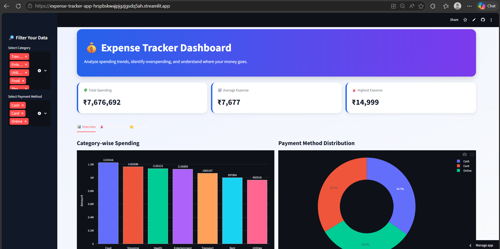
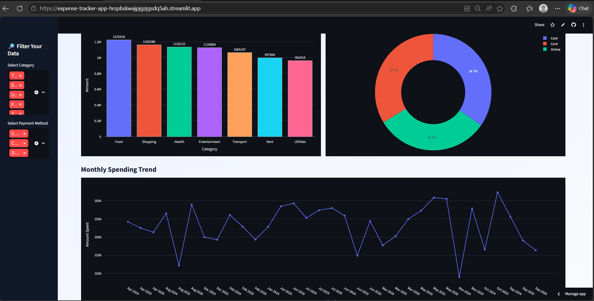
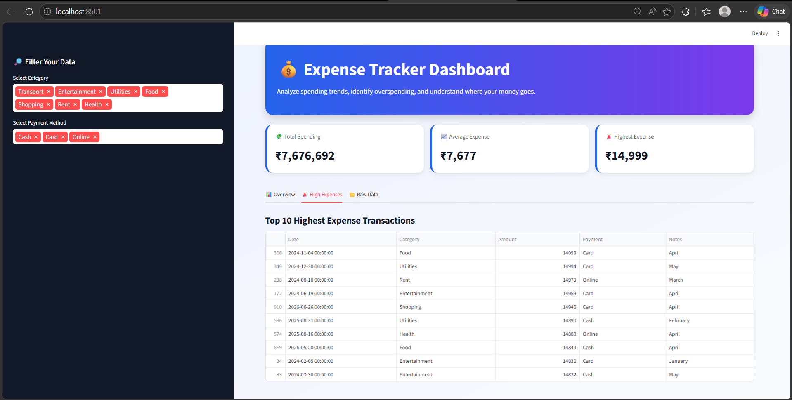
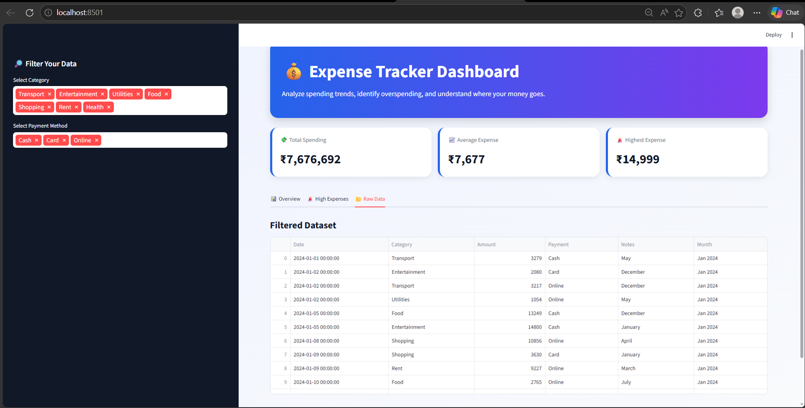

# 💰 Expense Tracker App using Data Science

## 📌 Project Overview

The Expense Tracker App is a data-driven project built using Python and Data Science techniques to help users track, categorize, analyze, and visualize their expenses.

This project simulates how modern FinTech applications analyze financial behavior and spending patterns. It provides meaningful insights such as:

* Highest spending category
* Monthly spending trends
* Overspending detection
* Payment method analysis
* Expense distribution by category

The project is beginner-friendly but designed in a professional way suitable for:

* Placement preparation
* Internship portfolios
* GitHub showcase
* Data Analyst / Business Analyst / Financial Analyst roles

---

# 🎯 Objective

To build a system that:

* Stores expense records
* Cleans and processes expense data
* Generates insights from the data
* Visualizes spending patterns
* Detects unusually high expenses

---

# 🏢 Industry Relevance

Expense tracking systems are widely used in:

* Personal finance apps
* Banking applications
* FinTech companies
* Budget planning tools
* Business expense management systems

Similar systems are used by:

* Google Pay
* PhonePe
* CRED
* Mint
* Splitwise
* RazorpayX

---

# ⚙️ Tech Stack

| Tool        | Purpose                    |
| ----------- | -------------------------- |
| Python      | Main programming language  |
| Pandas      | Data cleaning and analysis |
| NumPy       | Numerical operations       |
| Matplotlib  | Static chart generation    |
| Plotly      | Interactive visualizations |
| Streamlit   | Dashboard creation         |
| CSV Dataset | Expense records            |

---

# 📂 Folder Structure

```text
Expense-Tracker-App/
│
├── data/
│   └── expenses.csv
│
├── outputs/
│   ├── charts/
│   │   ├── category_spending.png
│   │   ├── expense_distribution.png
│   │   ├── monthly_trend.png
│   │   └── payment_method_distribution.png
│   │
│   ├── high_expense_transactions.csv
│   └── summary_report.txt
│
├── dashboard.py
├── main.py
├── requirements.txt
└── README.md
```

---

# 📊 Dataset Used

The project uses a realistic personal expense dataset containing:

* Date
* Category
* Amount
* Payment Method
* Notes

Example categories:

* Food
* Rent
* Transport
* Shopping
* Entertainment
* Utilities
* Health

---

# 🚀 Features

* Category-wise spending analysis
* Monthly expense trend analysis
* Payment method distribution
* Overspending detection using top 5% threshold
* Automatic chart generation
* CSV export of high expense transactions
* Summary report generation
* Interactive Streamlit dashboard

---

# 🔄 Project Workflow

```text
Expense Data
      ↓
Data Cleaning
      ↓
Category Analysis
      ↓
Monthly Trend Analysis
      ↓
Overspending Detection
      ↓
Chart Generation
      ↓
Dashboard & Reports
```

---

# ▶️ How to Run the Project

## Step 1: Install Required Libraries

```bash
pip install pandas numpy matplotlib seaborn plotly streamlit
```

---

## Step 2: Run the Main Analysis Script

```bash
python main.py
```

This generates:

* Category-wise expense analysis
* Monthly trends
* Overspending detection
* Charts in `outputs/charts/`
* CSV and summary report files

---

## Step 3: Run the Dashboard

```bash
streamlit run dashboard.py
```

The dashboard opens automatically in the browser.

---

# 📈 Output Files Generated

After running the project, the following files are generated:

```text
outputs/
├── charts/
│   ├── category_spending.png
│   ├── expense_distribution.png
│   ├── monthly_trend.png
│   └── payment_method_distribution.png
├── high_expense_transactions.csv
└── summary_report.txt
```

---

# 📷 Screenshots to Add

## 📷 Dashboard Screenshots

### Dashboard Overview


### Category-wise Spending Analysis


### Monthly Expense Trend


### High Expense Transactions


---

# 🧠 Key Insights Generated

Example insights from the dataset:

* Food and Shopping are among the highest spending categories.
* The highest 5% of transactions are considered overspending.
* Monthly spending fluctuates over time.
* Payment method analysis helps understand user transaction behavior.

---

# 🚨 Overspending Detection Logic

The project identifies unusually high expenses using the top 5% of transaction amounts.

```python
threshold = df['Amount'].quantile(0.95)
high_expenses = df[df['Amount'] >= threshold]
```

This approach is more realistic than using a fixed amount.

---

# 📌 Sample Results

| Metric                    | Example    |
| ------------------------- | ---------- |
| Highest Spending Category | Food       |
| Overspending Threshold    | ₹14,194.75 |
| Total Transactions        | 1000       |
| Highest Expense           | ₹14,999    |

---


# 🔮 Future Improvements

Possible future enhancements:

* Real-time expense entry
* User login system
* AI-based monthly expense prediction
* Savings goal tracker
* Budget limit alerts
* Export to PDF or Excel
* Mobile app version

---


---

# 👩‍💻 Author

Swetha K

